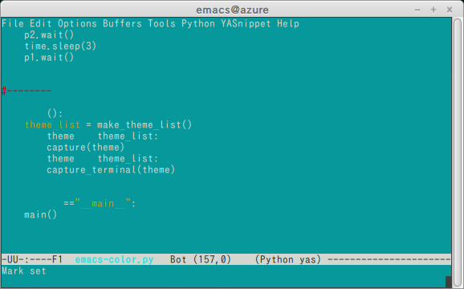
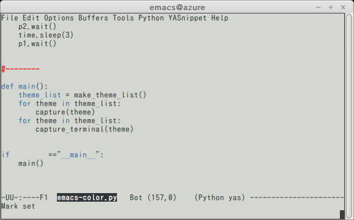
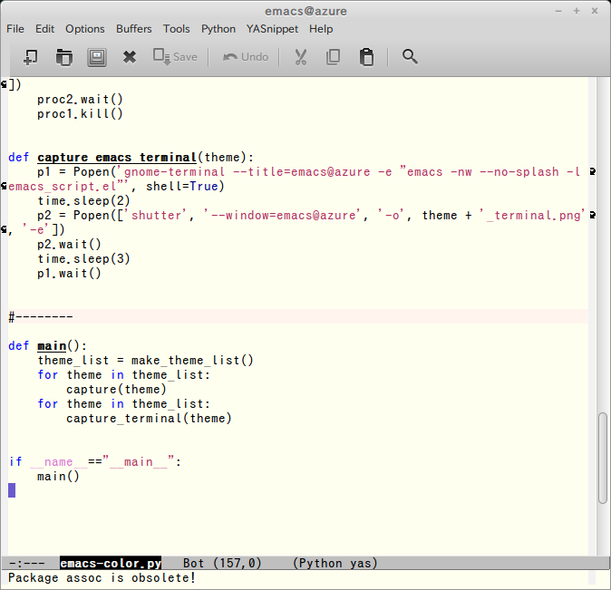
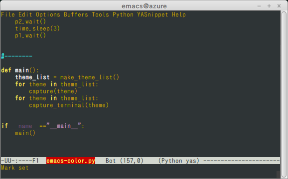
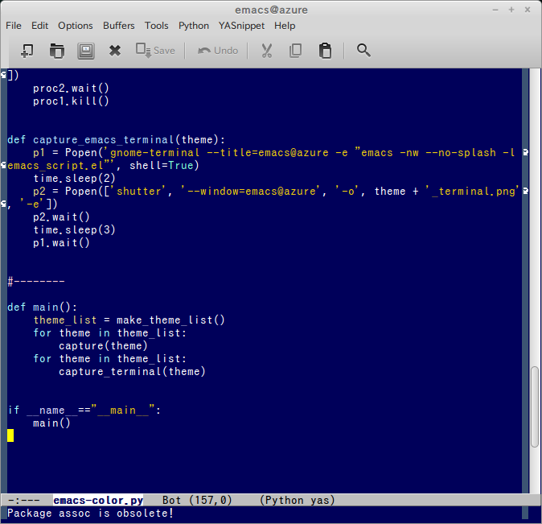
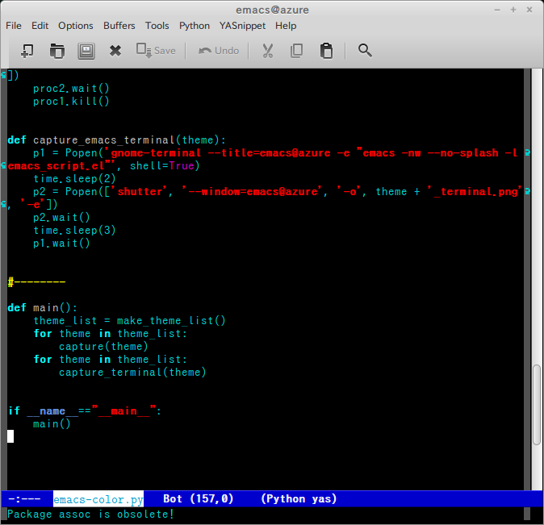
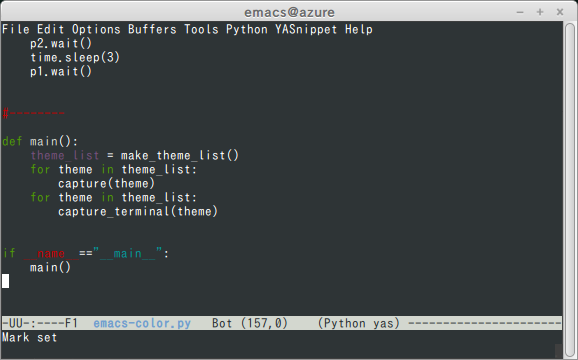
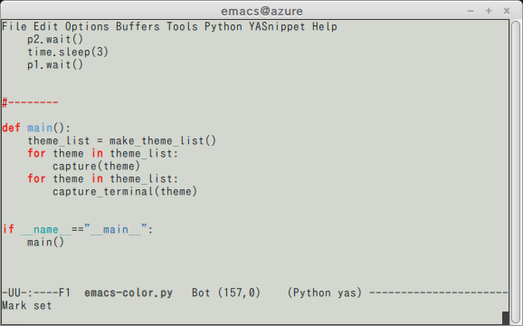
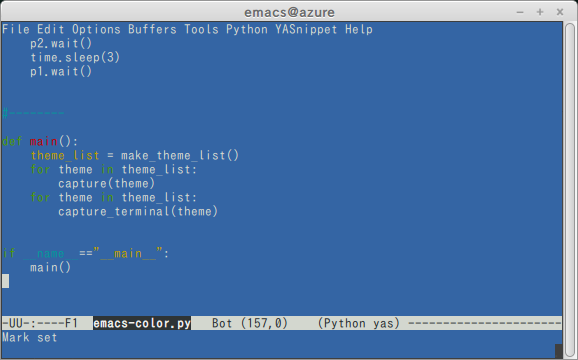

# Emacs Color Themes Image List

This simple python script (emacs-color.py) generates a series of Emacs color-theme images automatically.

The execution environment of the following images is:

- LinuxMint 17 Qiana, Cinamon 64bit.
- Emacs 24.

<table border="1">
<tr>
<td> color-theme-aalto-dark.png </td>
<td> color-theme-aalto-dark_terminal.png </td>
</tr>
<tr>
<td> color-theme-aalto-light.png </td>
<td> color-theme-aalto-light_terminal.png </td>
</tr>
<tr>
<td> color-theme-aliceblue.png </td>
<td> color-theme-aliceblue_terminal.png </td>
</tr>
<tr>
<td> color-theme-andreas.png </td>
<td> color-theme-andreas_terminal.png </td>
</tr>
<tr>
<td> color-theme-arjen.png </td>
<td> color-theme-arjen_terminal.png </td>
</tr>
<tr>
<td> color-theme-bharadwaj.png </td>
<td> color-theme-bharadwaj_terminal.png </td>
</tr>
<tr>
<td> color-theme-bharadwaj-slate.png </td>
<td> color-theme-bharadwaj-slate_terminal.png </td>
</tr>
<tr>
<td> color-theme-billw.png </td>
<td> color-theme-billw_terminal.png </td>
</tr>
<tr>
<td> color-theme-black-on-gray.png </td>
<td> color-theme-black-on-gray_terminal.png </td>
</tr>
<tr>
<td> color-theme-blippblopp.png </td>
<td> color-theme-blippblopp_terminal.png </td>
</tr>
<tr>
<td> color-theme-blue-eshell.png </td>
<td> color-theme-blue-eshell_terminal.png </td>
</tr>
<tr>
<td> color-theme-blue-gnus.png </td>
<td> color-theme-blue-gnus_terminal.png </td>
</tr>
<tr>
<td> color-theme-blue-mood.png </td>
<td> color-theme-blue-mood_terminal.png </td>
</tr>
<tr>
<td> color-theme-blue-sea.png </td>
<td> color-theme-blue-sea_terminal.png </td>
</tr>
<tr>
<td> color-theme-calm-forest.png </td>
<td> color-theme-calm-forest_terminal.png </td>
</tr>
<tr>
<td> color-theme-charcoal-black.png </td>
<td> color-theme-charcoal-black_terminal.png </td>
</tr>
<tr>
<td> color-theme-clarity.png </td>
<td> color-theme-clarity_terminal.png </td>
</tr>
<tr>
<td> color-theme-classic.png </td>
<td> color-theme-classic_terminal.png </td>
</tr>
<tr>
<td> color-theme-comidia.png </td>
<td> color-theme-comidia_terminal.png </td>
</tr>
<tr>
<td> color-theme-dark-blue.png </td>
<td> color-theme-dark-blue_terminal.png </td>
</tr>
<tr>
<td> color-theme-dark-blue2.png </td>
<td> color-theme-dark-blue2_terminal.png </td>
</tr>
<tr>
<td> color-theme-dark-erc.png </td>
<td> color-theme-dark-erc_terminal.png </td>
</tr>
<tr>
<td> color-theme-dark-font-lock.png </td>
<td> color-theme-dark-font-lock_terminal.png </td>
</tr>
<tr>
<td> color-theme-dark-gnus.png </td>
<td> color-theme-dark-gnus_terminal.png </td>
</tr>
<tr>
<td> color-theme-dark-green.png </td>
<td> color-theme-dark-green_terminal.png </td>
</tr>
<tr>
<td> color-theme-dark-info.png </td>
<td> color-theme-dark-info_terminal.png </td>
</tr>
<tr>
<td> color-theme-dark-laptop.png </td>
<td> color-theme-dark-laptop_terminal.png </td>
</tr>
<tr>
<td> color-theme-deep-blue.png </td>
<td> color-theme-deep-blue_terminal.png </td>
</tr>
<tr>
<td> color-theme-digital-ofs1.png </td>
<td> color-theme-digital-ofs1_terminal.png </td>
</tr>
<tr>
<td> color-theme-emacs-21.png </td>
<td> color-theme-emacs-21_terminal.png </td>
</tr>
<tr>
<td> color-theme-emacs-nw.png </td>
<td> color-theme-emacs-nw_terminal.png </td>
</tr>
<tr>
<td> color-theme-euphoria.png </td>
<td> color-theme-euphoria_terminal.png </td>
</tr>
<tr>
<td> color-theme-example.png </td>
<td> color-theme-example_terminal.png </td>
</tr>
<tr>
<td> color-theme-feng-shui.png </td>
<td> color-theme-feng-shui_terminal.png </td>
</tr>
<tr>
<td> color-theme-fischmeister.png </td>
<td> color-theme-fischmeister_terminal.png </td>
</tr>
<tr>
<td> color-theme-gnome.png </td>
<td> color-theme-gnome_terminal.png </td>
</tr>
<tr>
<td> color-theme-gnome2.png </td>
<td> color-theme-gnome2_terminal.png </td>
</tr>
<tr>
<td> color-theme-goldenrod.png </td>
<td> color-theme-goldenrod_terminal.png </td>
</tr>
<tr>
<td> color-theme-gray1.png </td>
<td> color-theme-gray1_terminal.png </td>
</tr>
<tr>
<td> color-theme-gray30.png </td>
<td> color-theme-gray30_terminal.png </td>
</tr>
<tr>
<td> color-theme-greiner.png </td>
<td> color-theme-greiner_terminal.png </td>
</tr>
<tr>
<td> color-theme-gtk-ide.png </td>
<td> color-theme-gtk-ide_terminal.png </td>
</tr>
<tr>
<td> color-theme-high-contrast.png </td>
<td> color-theme-high-contrast_terminal.png </td>
</tr>
<tr>
<td> color-theme-hober.png </td>
<td> color-theme-hober_terminal.png </td>
</tr>
<tr>
<td> color-theme-infodoc.png </td>
<td> color-theme-infodoc_terminal.png </td>
</tr>
<tr>
<td> color-theme-jb-simple.png </td>
<td> color-theme-jb-simple_terminal.png </td>
</tr>
<tr>
<td> color-theme-jedit-grey.png </td>
<td> color-theme-jedit-grey_terminal.png </td>
</tr>
<tr>
<td> color-theme-jonadabian.png </td>
<td> color-theme-jonadabian_terminal.png </td>
</tr>
<tr>
<td> color-theme-jonadabian-slate.png </td>
<td> color-theme-jonadabian-slate_terminal.png </td>
</tr>
<tr>
<td> color-theme-jsc-dark.png </td>
<td> color-theme-jsc-dark_terminal.png </td>
</tr>
<tr>
<td> color-theme-jsc-light.png </td>
<td> color-theme-jsc-light_terminal.png </td>
</tr>
<tr>
<td> color-theme-jsc-light2.png </td>
<td> color-theme-jsc-light2_terminal.png </td>
</tr>
<tr>
<td> color-theme-katester.png </td>
<td> color-theme-katester_terminal.png </td>
</tr>
<tr>
<td> color-theme-kingsajz.png </td>
<td> color-theme-kingsajz_terminal.png </td>
</tr>
<tr>
<td> color-theme-late-night.png </td>
<td> color-theme-late-night_terminal.png </td>
</tr>
<tr>
<td> color-theme-lawrence.png </td>
<td> color-theme-lawrence_terminal.png </td>
</tr>
<tr>
<td> color-theme-ld-dark.png </td>
<td> color-theme-ld-dark_terminal.png </td>
</tr>
<tr>
<td> color-theme-lethe.png </td>
<td> color-theme-lethe_terminal.png </td>
</tr>
<tr>
<td> color-theme-marine.png </td>
<td> color-theme-marine_terminal.png </td>
</tr>
<tr>
<td> color-theme-marquardt.png </td>
<td> color-theme-marquardt_terminal.png </td>
</tr>
<tr>
<td> color-theme-matrix.png </td>
<td> color-theme-matrix_terminal.png </td>
</tr>
<tr>
<td> color-theme-midnight.png </td>
<td> color-theme-midnight_terminal.png </td>
</tr>
<tr>
<td> color-theme-mistyday.png </td>
<td> color-theme-mistyday_terminal.png </td>
</tr>
<tr>
<td> color-theme-montz.png </td>
<td> color-theme-montz_terminal.png </td>
</tr>
<tr>
<td> color-theme-oswald.png </td>
<td> color-theme-oswald_terminal.png </td>
</tr>
<tr>
<td> color-theme-parus.png </td>
<td> color-theme-parus_terminal.png </td>
</tr>
<tr>
<td> color-theme-pierson.png </td>
<td> color-theme-pierson_terminal.png </td>
</tr>
<tr>
<td> color-theme-pok-wob.png </td>
<td> color-theme-pok-wob_terminal.png </td>
</tr>
<tr>
<td> color-theme-pok-wog.png </td>
<td> color-theme-pok-wog_terminal.png </td>
</tr>
<tr>
<td> color-theme-ramangalahy.png </td>
<td> color-theme-ramangalahy_terminal.png </td>
</tr>
<tr>
<td> color-theme-raspopovic.png </td>
<td> color-theme-raspopovic_terminal.png </td>
</tr>
<tr>
<td> color-theme-renegade.png </td>
<td> color-theme-renegade_terminal.png </td>
</tr>
<tr>
<td> color-theme-resolve.png </td>
<td> color-theme-resolve_terminal.png </td>
</tr>
<tr>
<td> color-theme-retro-green.png </td>
<td> color-theme-retro-green_terminal.png </td>
</tr>
<tr>
<td> color-theme-retro-orange.png </td>
<td> color-theme-retro-orange_terminal.png </td>
</tr>
<tr>
<td> color-theme-robin-hood.png </td>
<td> color-theme-robin-hood_terminal.png </td>
</tr>
<tr>
<td> color-theme-rotor.png </td>
<td> color-theme-rotor_terminal.png </td>
</tr>
<tr>
<td> color-theme-ryerson.png </td>
<td> color-theme-ryerson_terminal.png </td>
</tr>
<tr>
<td> color-theme-salmon-font-lock.png </td>
<td> color-theme-salmon-font-lock_terminal.png </td>
</tr>
<tr>
<td> color-theme-scintilla.png </td>
<td> color-theme-scintilla_terminal.png </td>
</tr>
<tr>
<td> color-theme-shaman.png </td>
<td> color-theme-shaman_terminal.png </td>
</tr>
<tr>
<td> color-theme-simple-1.png </td>
<td> color-theme-simple-1_terminal.png </td>
</tr>
<tr>
<td> color-theme-sitaramv-nt.png </td>
<td> color-theme-sitaramv-nt_terminal.png </td>
</tr>
<tr>
<td> color-theme-sitaramv-solaris.png </td>
<td> color-theme-sitaramv-solaris_terminal.png </td>
</tr>
<tr>
<td> color-theme-snow.png </td>
<td> color-theme-snow_terminal.png </td>
</tr>
<tr>
<td> color-theme-snowish.png </td>
<td> color-theme-snowish_terminal.png </td>
</tr>
<tr>
<td> color-theme-standard.png </td>
<td> color-theme-standard_terminal.png </td>
</tr>
<tr>
<td> color-theme-subtle-blue.png </td>
<td> color-theme-subtle-blue_terminal.png </td>
</tr>
<tr>
<td> color-theme-subtle-hacker.png </td>
<td> color-theme-subtle-hacker_terminal.png </td>
</tr>
<tr>
<td> color-theme-taming-mr-arneson.png </td>
<td> color-theme-taming-mr-arneson_terminal.png </td>
</tr>
<tr>
<td> color-theme-taylor.png </td>
<td> color-theme-taylor_terminal.png </td>
</tr>
<tr>
<td> color-theme-tty-dark.png </td>
<td> color-theme-tty-dark_terminal.png </td>
</tr>
<tr>
<td> color-theme-vim-colors.png </td>
<td> color-theme-vim-colors_terminal.png </td>
</tr>
<tr>
<td> color-theme-whateveryouwant.png </td>
<td> color-theme-whateveryouwant_terminal.png </td>
</tr>
<tr>
<td> color-theme-wheat.png </td>
<td> color-theme-wheat_terminal.png </td>
</tr>
<tr>
<td> color-theme-word-perfect.png </td>
<td> color-theme-word-perfect_terminal.png </td>
</tr>
<tr>
<td> color-theme-xemacs.png </td>
<td> color-theme-xemacs_terminal.png </td>
</tr>
<tr>
<td> color-theme-xp.png </td>
<td> color-theme-xp_terminal.png </td>
</tr>
</table>
